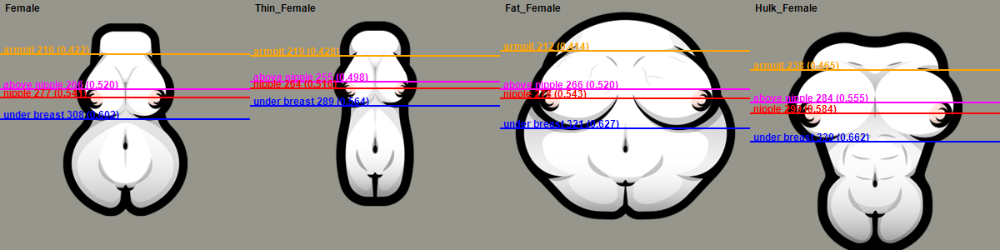

# Bust lines of WDI's female bodies

Rows of the 512 px south view, counted from the top. Validated by Virginie on 2026-10-08 (Hulk bottom excepted). They are the anchors for fitting a dress to the bust: the dress is stretched in bands between these lines.

| Body | Armpit | Above nipple | Nipple | Under breast |
|---|---|---|---|---|
| Female | 216 | 266 | 277 | 308 |
| Thin_Female | 219 | 255 | 264 | 289 |
| Fat_Female | 212 | 266 | 278 | 321 |
| Hulk_Female | 238 | 284 | 299 | 339 (estimate) |

- **Armpit:** the last row without a breast curve, going up from the breast (hand-checked on Female, then by rule).
- **Above nipple:** the row above the first pixel of nipple (`scripts/measure-bust.js`, pink pixels).
- **Nipple:** the mean row of the pink pixels.
- **Under breast:** the first row without breast under the black outline of the breast, read on a column 14 px inside the nipple. On the Hulk the outline joins the abdominals, so the value is an estimate.

